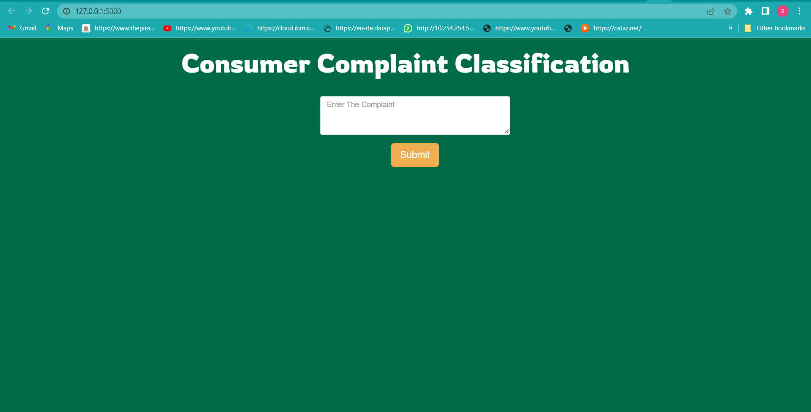
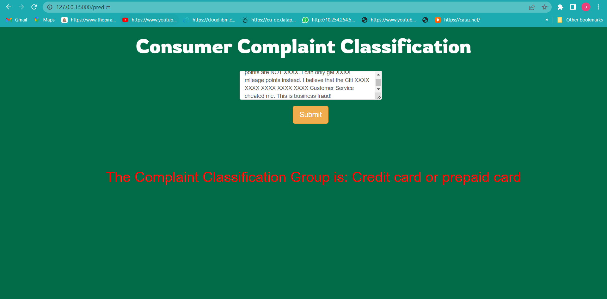

# Consumer-Complaint-Classification-

----------------------------------
### Software and Tools Requirements
1. [GitHub Account](https://www.github.com) 
2. [Pycharm IDE](https://www.jetbrains.com/pycharm) 
3. [GitCLI](https://git-scm.com/downloads)
4. [python]()
5. [Anaconda]()
6. [jupyter]()
7. [scikit-learn]()
8. [nltk]()
9. [numpy]()
10. [Pandas]()

-----------------------------
This is an End to End Project where a web app is created to show how the model works and
interacts with the front end structure.

The screenshot of the web app are given below:

The above webpage shows the front end of the deployed model where
we can enter the text data that is the complaint and the model will classify
which type of complaint is given as input

The output will be somthing like this:

Natural language librabry nltk(Natural language Tool Kit) was used to preprocess the data and 
to train the model SGD(Stochastic Gradient Descent) was used by using scikit-learn library